Fonctionnalités
===============

Page d'accueil
--------------
Une fois la page d'authentification passée, la page d'accueil s'affiche, comme
comme sur la figure qui suit.
Il s'agit de l'interface principale de VigiGraph.

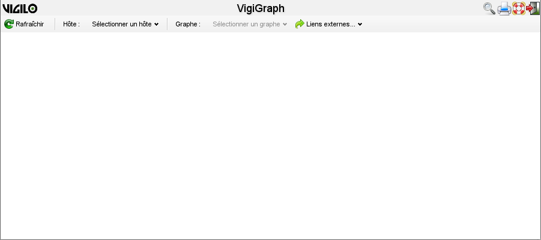

    Page d'accueil.

Cette page permet à la fois la recherche, la visualisation, et l'impression des
graphes.

Sélection d'un hôte
-------------------
L'accès à la plupart des fonctionnalités de VigiGraph nécessite que le champ
« Hôte » de la barre de sélection soit renseigné.

..  _fig-selection-bar:
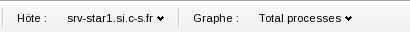

    Barre de sélection.

Après un premier clic sur le bouton « Sélectionner un hôte », une boîte de
dialogue permet de choisir l'hôte souhaité parmi l'arborescence des groupes
configurés dans Vigilo.

..  _fig-select-host:
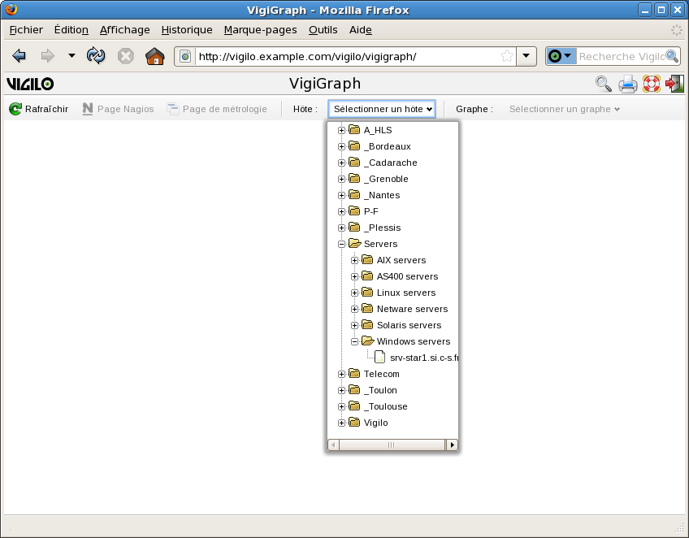

    Sélection de l'hôte.

Sélection d'un graphe à afficher
--------------------------------

Une fois un hôte sélectionné, le bouton « Sélectionner un graphe » devient
actif.

Un clic sur ce bouton permet de choisir un graphe à afficher parmi la liste de
graphes diponibles pour cet hôte. La fenêtre de visualisation s'ouvre alors,
comme le montre l'illustration suivante :

..  _fig-graph-window:
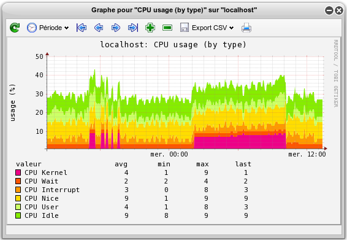

    Affichage du graphe après sélection de l'hôte et du graphe.

Cette fenêtre est décrite plus en détail dans la section `Visualisation d'un
graphe`_.

..  note::
    Il est tout à fait possible de sélectionner plusieurs graphes de plusieurs
    hôtes pour un affichage simultané.

Recherche
---------
Cette fenêtre permet de rechercher parmi la liste des couples Hôtes/Graphes
disponibles.
L'activation s'effectue par un clic sur l'icône en forme de loupe |lens| située
en haut à droite de l'interface.

..  |lens| image:: img/lens.png
    :alt: loupe

La fenêtre de recherche se présente au départ comme sur l'illustration
suivante :

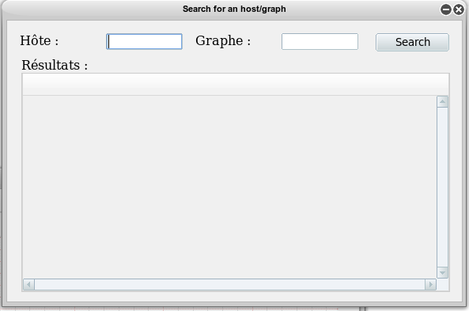

    État initial du formulaire de recherche.

Les caractères « ? » et « \* » permettent de représenter un caractère
quelconque ou une suite de caractères quelconques, respectivement.

Un clic sur le bouton « Rechercher » provoque l'affichage de la liste complète
des couples Hôtes/Graphes déclarés en base de données et correspondant aux
motifs de recherche saisis.

Si aucun texte n'a été saisi dans le champ « Hôte » et le champ « Graphe »,
la liste complète de tous les couples Hôtes/Graphes disponibles est affichée.

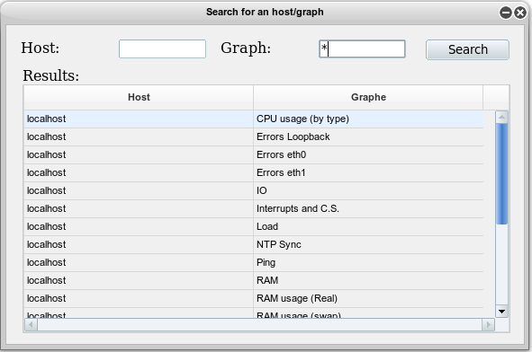

    Liste de tous les graphes disponibles.

Les champs de saisie « Hôte » et « Graphe » permettent la saisie de critères
de recherche sur un serveur ou un graphe particulier.

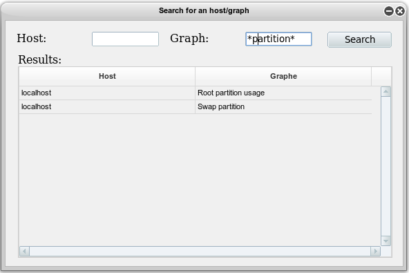

    Recherche des graphes portant sur une partition.

et/ou :

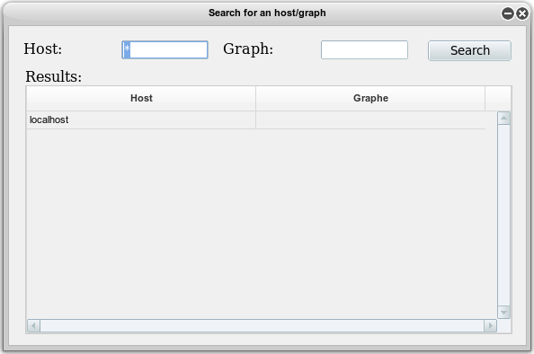

    Recherche parmi les hôtes.

Les deux critères peuvent être combinés afin de n'afficher que
certains graphes d'un ensemble d'hôtes.

La sélection d'un élément de cette liste est possible par un clic sur la ligne
correspondante. Ce clic provoque l'actualisation de la fenêtre « Sélection d'un
hôte » afin de sélectionner l'hôte (et éventuellement le graphe) cliqué. Si
l'élément cliqué correspond à un graphe, le graphe est affiché à l'écran, comme
sur l'illustration suivante :

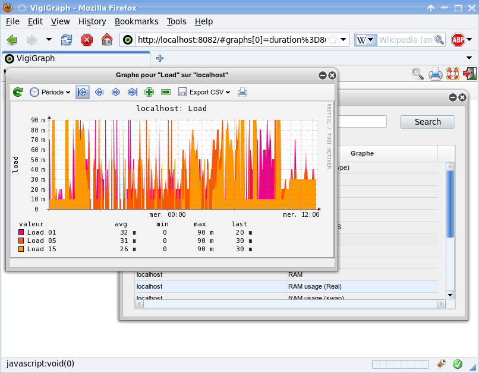

    Affichage d'un graphe suite à un clic dans la fenêtre de recherche.

Visualisation d'un graphe
-------------------------
L'affichage des graphes s'effectue dans une fenêtre distincte, semblable
à celle présentée dans l'illustration suivante :

    Fenêtre de visualisation d'un graphe.

Cette fenêtre comporte :

- une barre de titre rappelant le nom de l'hôte et du graphe affiché ;
- des boutons de gestion de l'affichage du graphe ;
- la zone d'affichage à proprement parler.

Le graphe donne l'évolution des valeurs dans le temps, avec un intervalle de
temps par défaut qui couvre les dernières 24 heures.

L'utilisateur peut modifier cette durée en cliquant sur les boutons |plus| et
|minus|.

Ceci provoque le rafraîchissement des données sur une durée respectivement
diminuée ou agrandie avec un facteur 2.

La sélection de la plage de temps est aussi possible :

- par un clic sur un des boutons |graph_start|, |previous_section|,
  |next_section|, et |graph_end| (respectivement plage de
  début, plage précédente, plage suivante et plage de fin) ;

- ou par un choix dans la liste obtenue après un clic sur le bouton « Période » |time_period|.

  Ceci provoque le rafraîchissement des données sur la durée courante.

Dans l'illustration, le bouton |graph_start|
a été utilisé afin de se replacer au tout début de la période d'enregistrement.
Partant de cette situation, l'utilisation du bouton |next_section| donne par
exemple le graphe suivant :

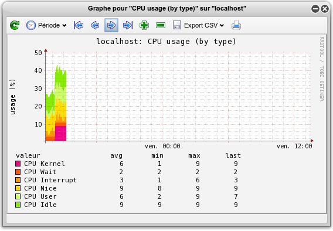

    Progression dans le temps.

Le tableau suivant liste l'ensemble des boutons disponibles dans la fenêtre de
visualisation, et détaille leur fonctionnement :

..  list-table:: Liste des boutons
    :widths: 10 25 65
    :header-rows: 1

    * - Bouton
      - Intitulé de la bulle d'aide
      - Détail
    * - |reload|
      - Recharger le graphe
      - Rafraîchissement automatique du graphe selon la fréquence configurée :

        - bouton enfoncé → rafraîchissement automatique
        - bouton relâché → pas de rafraîchissement
    * - |time_period|
      - Menu de choix de la période
      - Rafraîchissement du graphe avec adaptation à la plage de temps
    * - |graph_start|
      - Début du graphe
      - Rafraîchissement du graphe avec les valeurs de la première plage de
        temps
    * - |previous_section|
      - Section précédente
      - Rafraîchissement du graphe avec les valeurs de la plage de temps
        précédente
    * - |next_section|
      - Section suivante
      - Rafraîchissement du graphe avec les valeurs de la plage de temps
        suivante
    * - |graph_end|
      - Fin du graphe
      - Rafraîchissement du graphe avec les valeurs de la dernière plage de
        temps
    * - |plus|
      - Zoomer
      - Rafraîchissement du graphe avec agrandissement de la plage de temps
        (x 2)
    * - |minus|
      - Dézoomer
      - Rafraîchissement du graphe avec diminution de la plage de temps (/ 2)
    * - |export|
      - Export CSV
      - Export du graphe
    * - |print|
      - Imprimer le graphe
      - Impression du graphe

..  |reload| image:: img/reload.png
    :alt: rechargement
..  |time_period| image:: img/time_period.png
    :alt: période
..  |graph_start| image:: img/graph_start.png
    :alt: plage de début
..  |previous_section| image:: img/previous_section.png
    :alt: plage précédente
..  |next_section| image:: img/next_section.png
    :alt: plage suivante
..  |graph_end| image:: img/graph_end.png
    :alt: plage de fin
..  |plus| image:: img/plus.png
    :alt: plus
..  |minus| image:: img/minus.png
    :alt: plus
..  |export| image:: img/export.png
    :alt: export
..  |print| image:: img/print.png
    :alt: impression

Consultation d'une page de supervision
--------------------------------------
Cette fonctionnalité permet de consulter la page Nagios de l'hôte actuellement
sélectionné (voir la section `Sélection d'un hôte`_).

L'activation s'effectue par un clic sur le bouton « Liens externes » dans la
barre de sélection de l'hôte, suivi par un clic sur le bouton « Page Nagios ».

L'affichage s'effectue dans une page distincte, comme le montre l'illustration
suivante :

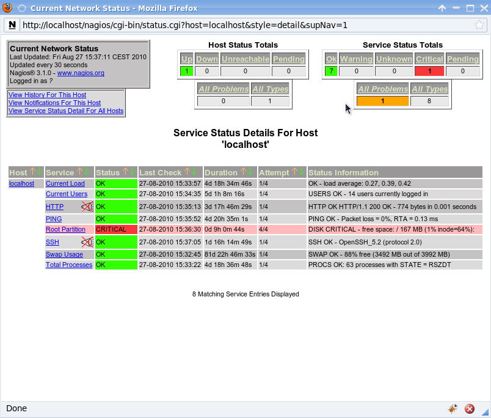

    Exemple d'une page de supervision Nagios.

Consultation de l'ensemble des graphes de métrologie d'un hôte
--------------------------------------------------------------
Cette fonctionnalité permet de consulter l'ensemble des graphes de métrologie
de l'hôte actuellement sélectionné (voir la section `Sélection d'un hôte`_).

L'activation s'effectue par un clic sur le bouton « Liens externes » dans la
barre de sélection de l'hôte, suivi par un clic sur le bouton « Page de
métrologie ».

L'affichage s'effectue dans une page distincte, comme le montre l'illustration
suivante :

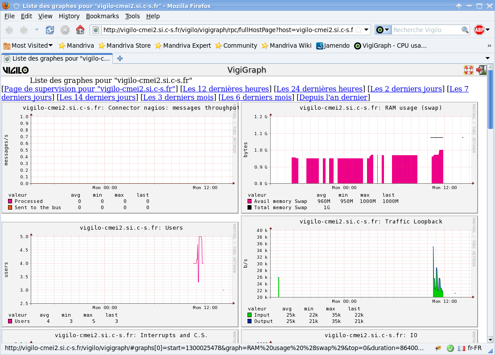

    Vue synthétique de tous les graphes d'un hôte.

Impression d'un graphe
----------------------
Cette fonctionnalité permet d'imprimer le graphe courant, tel
qu'il est actuellemnet présenté à l'écran.

L'activation de l'impression s'effectue par un clic sur le bouton |print| de la
fenêtre de visualisation du graphe.

Une fenêtre d'impression s'affiche alors.

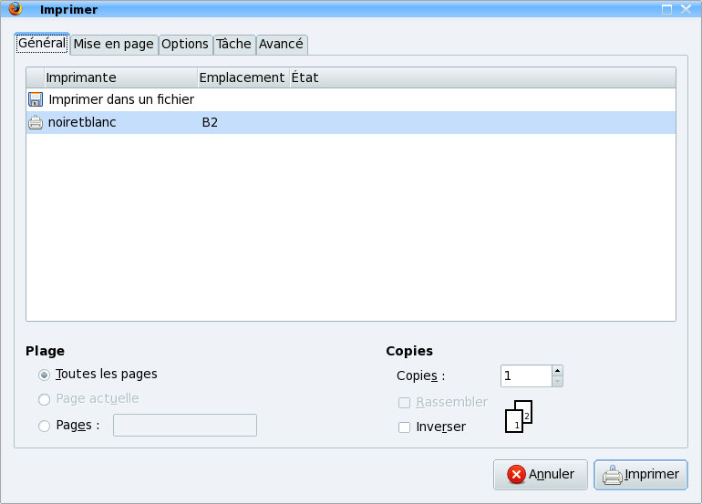

    Fenêtre d'impression d'un graphe.

Après renseignement des paramètres d'impression et validation, cette fenêtre se
referme et l'impression commence.

..  note::
    Si plusieurs graphes sont affichés à l'écran au moment de l'activation de
    l'impression, ils seront tous imprimés.

Export d'un graphe
------------------
Cette fonctionnalité permet d'exporter le graphe courant.

L'activation de l'export s'effectue par un clic sur le bouton |export| de la
fenêtre de visualisation du graphe, suivi par un clic sur nom de l'indicateur à
exporter (ou sur le label « Tous » pour exporter simultanément tous les
indicateurs du graphe).

La fenêtre d'export s'affiche alors, comme sur l'illustration suivante :

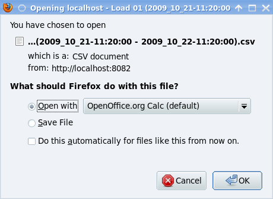

    Fenêtre de sauvegarde des données exportées.

Une fois l'une des options validée, la fenêtre se referme. Le fichier généré
est consultable à l'aide d'un tableur. Le contenu se présente comme suit :

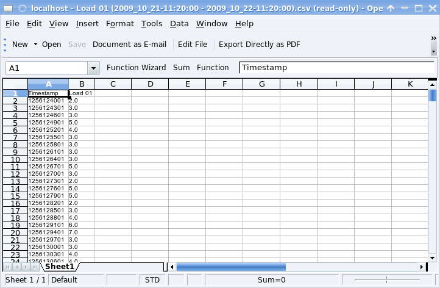

    Données exportées vues dans un tableur.

La sortie par défaut d'un fichier au format CSV se caractérise comme suit :

- Les valeurs sont entourées par des guillemets droits (") et séparées par des
  points virgules (;).
- Le contre-oblique (\) est utilisé en tant que caractère d'échappement.
- La première ligne du fichier contient un en-tête composé des libellés des
  champs dans leur ordre d'apparition (« Timestamp » puis l'indicateur ou la
  série d'indicateurs exportés).
- Les lignes suivantes correspondent aux valeurs de chaque indicateur à
  l'instant identifié par la valeur de la colonne « Timestamp ».
- Les lignes sont triées par ordre chronologique croissant.

L'administrateur peut choisir de paramétrer différemment l'export (notamment
les caractères utilisés pour la séparation des valeurs, leur délimitation ou le
caractère d'échappement). Consultez votre administrateur afin de connaître le
format exact des fichiers générés.

Rafraîchissement automatique d'un graphe
----------------------------------------
Cette fonctionnalité permet de réactualiser un graphe périodiquement.

La période figure dans un fichier de configuration ; elle est exprimée en
secondes. Par défaut, elle est initialisée à 30 secondes. Cette donnée n'est
pas modifiable via l'application. Elle est gérée par l'administrateur système.

L'activation s'effectue par un clic sur le bouton |auto_refresh_enabled| de la
fenêtre de visualisation du graphe. Le bouton apparaît alors enfoncé.

..  |auto_refresh_enabled| image:: img/auto_refresh_enabled.png
    :alt: rafraîchissement automatique

La désactivation s'effectue aussi par un clic sur le même bouton. Celui-ci
apparaît alors relâché. L'illustration suivante présente l'état du bouton selon
que le rafraîchissement automatique est activé ou non :

  .. image:: img/auto_refresh.png

  Illustration : Rafraîchissement automatique activé (à gauche) et désactivé (à
  droite)

Un bouton global |auto_refresh_global| permet également d'activer ou de
désactiver le rafraîchissement automatique sur l'ensemble des graphes visibles
à l'écran.

..  |auto_refresh_global| image:: img/auto_refresh_global.png
    :alt: rafraîchissement automatique global

Le comportement de ce bouton est similaire à celui du bouton positionné sur
chaque fenêtre de graphe : un clic permet d'activer le rafraîchissement (le
bouton apparaît alors enfoncé), un nouveau clic désactive le rafraîchissement
(le bouton apparaît alors relâché).

Sauvegarde de l'affichage
-------------------------
Cette fonctionnalité permet de sauvegarder un ensemble de graphes affichés à
l'écran pour des opérations ultérieures.

La sauvegarde s'effectue via le navigateur, en ajoutant un marque-page.
Par exemple, sous Firefox :

- Cliquer sur le menu « Marque-Pages ».
- Choisir l'option « Marquer cette page ».
- Saisir un nom pour le marque-page (ou laisser la valeur par défaut).
- Choisir un dossier de destination (par exemple « Barre personnelle »).
- Valider par un clic sur le bouton « Terminer ».

Le rappel de la sélection s'effectue également via le navigateur ; par exemple,
sous Firefox :

- Cliquer sur le menu « Marque-Pages ».
- Sélectionner l'élément créé précédemment lors de l'ajout du marque-page .

Moteur de recherche
-------------------
En plus de la fonctionnalité de recherche accessible directement depuis la page
d'accueil (voir la section `Recherche`_), VigiGraph est livré avec un moteur de
recherche qui peut être utilisé directement depuis la barre de recherche de
votre navigateur.

La procédure qui suit décrit l'ajout et l'utilisation de ce moteur de recherche
depuis Firefox ; dans le cas où vous souhaiteriez utiliser un autre navigateur
pour accéder à VigiGraph, reportez-vous au manuel dudit navigateur pour savoir
comment adapter cette procédure.

Pour enregistrer le moteur de recherche sous Firefox (cette manipulation n'est
à effectuer qu'une seule fois) :

- Cliquer sur le bouton à gauche de la zone des moteurs de recherche.
  → La liste des moteurs actuellement enregistrés s'affiche, ainsi que des
  actions possibles.
- Cliquer sur la ligne « Ajouter "Recherche Vigilo" ».
  → Le moteur de recherche de VigiGraph est ajouté à la liste des moteurs de
  recherche disponibles et la liste disparaît de l'écran.

Une fois le moteur de recherche enregistré, il apparaît dans le navigateur sous
la forme d'une zone de saisie.

Pour effectuer une recherche :

- Cliquer sur le bouton à gauche et choisir « Recherche Vigilo » (représenté
  par l'icône de Vigilo : un œil vert) dans la liste des moteurs de recherche.
- Saisir un intitulé dans la zone de saisie.
- Cliquer sur le bouton en forme de loupe à droite ou valider à l'aide de la
  touche « Entrée ».

→ Une page présentant des informations sur les serveurs répondant à la requête
  s'affiche alors.

Un exemple de résultats obtenus lors de la recherche du terme « local » est
présenté sur l'illustration suivante :

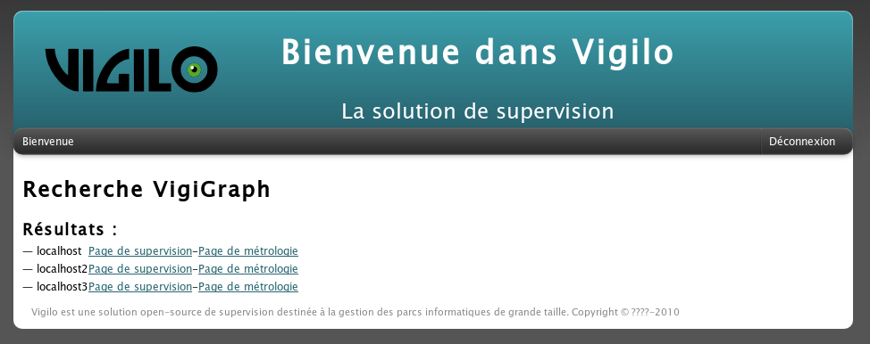

    Résultat de l'utilisation du moteur de recherche.

Dans cette page, sur chaque ligne, figurent :

- le nom de l'équipement ;
- un lien vers la page de supervision (voir la section `Consultation d'une page
  de supervision`_) ;
- un lien vers la métrologie de l'hôte, c'est-à-dire la liste de ses graphes
  (voir la section `Consultation de l'ensemble des graphes de métrologie d'un
  hôte`_).

Un clic sur l'un de ces liens remplace la page courante par la page demandée.

.. vim: set tw=79 :
