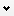
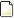
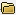
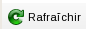
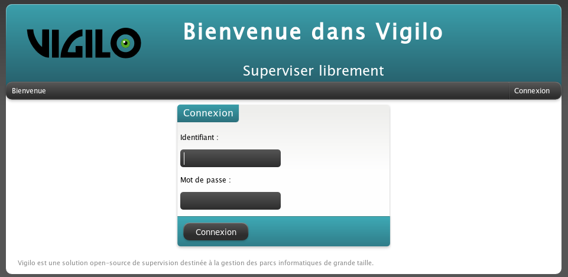

********************
Guide d'utilisation
********************

Description générale de l'application
=====================================

Présentation
------------
L'objectif de VigiGraph est de fournir une interface unifiée d'accès à
l'ensemble des applications web de supervision et de métrologie (Nagios,
VigiRRD), alors même que ces interfaces sont réparties sur plusieurs serveurs.
Il s'agit de l'une des deux interfaces directement utilisées en permanence
par le personnel chargé d'assurer la surveillance des systèmes à superviser.
Cette interface permet, en quelques clics, d'afficher les données de supervision relatives à un serveur ou des graphiques de métrologie correspondants, sur des plages de temps aisément paramétrables.
Pour les graphiques, l'impression et l'export (sous forme de fichier CSV) sont de plus possibles.

Principales données accessibles
-------------------------------
VigiGraph accède aux données suivantes :

- des données de configuration	:	dans les fichiers de configuration,
- des données de métrologie	:	dans les fichiers RRD,
- des données de supervision	:	Nagios,
- des données diverses		:	en Base de Données (Groupes, Serveurs, Graphes, Utilisateurs, …).

Services annexes
----------------
Néant.

Utilisateurs
------------

Authentification d'un utilisateur
^^^^^^^^^^^^^^^^^^^^^^^^^^^^^^^^^
Un utilisateur s'authentifie à l'aide de deux informations : un identifiant et un mot de passe.

Utilisation de l'application
============================

Configuration pré-requise
-------------------------
L'application s'utilise via un navigateur web, au travers d'une adresse internet (URL). Cette adresse vous a été transmise par votre administrateur.
Le reste de ce document présente des captures d'écran réalisées sous Mozilla Firefox 3.6. D'autres navigateurs ou d'autres versions du navigateur Mozilla Firefox peuvent également être utilisés. Certaines fonctionnalités font appel à des outils intégrés au navigateur (marque-pages, moteurs de recherche, …) et peuvent ne pas être disponibles sur votre navigateur ou nécessiter une légère adaptation.

Procédure de connexion
----------------------

- Sur le Poste Client, lancer le navigateur web
  → la page d'accueil du navigateur s'affiche

    ..  figure:: img/address_bar.png

        Navigateur web au démarrage.

- Dans la zone de saisie de l'adresse de cette fenêtre (zone entourée sur la copie d'écran), tapez l'adresse du serveur web qui héberge VigiGraph. Il s'agit de l'adresse que votre administrateur vous a transmis pour l'accès à VigiGraph.
  Exemple : http://supervision.example.com/vigigraph/
- Valider en appuyant sur la touche « Entrée »
  → Si vous ne vous êtes jamais connecté sur VigiGraph ou si vous n'êtes plus authentifié, le formulaire d'authentification de l'illustration  s'affiche.

..  note::

    Dans le cas où un mécanisme d'authentification externe a été défini par votre
    administrateur, il se peut qu'aucune authentification ne vous soit demandée, même lorsqu'il
    s'agit de votre première connexion. Le reste de cette section décrit le cas où une
    authentification interne a lieu et ne s'applique donc pas au cas de figure cité ci-dessus,
    l'application vous authentifiant automatiquement grâce à d'autres informations.
    Contactez votre administrateur pour plus d'information.

- Saisir les données d'authentification en renseignant les zones de saisie « Identifiant » et « Mot de passe ».
- Valider la saisie en cliquant sur le bouton « Connexion » (entouré en rouge sur l'illustration ).

→ En cas de succès, la page principale de VigiGraph s'affiche, comme sur l'illustration .

..  figure:: img/homepage.png

    Page principale de VigiGraph.

Cette page comporte en particulier un formulaire de saisie : la fenêtre de sélection d'hôte. Cette dernière est destinée à la saisie d'informations sur les groupes, serveur cible et graphe que l'on souhaite représenter.

→ En cas d'erreur, le formulaire d'authentification s'affiche à nouveau, avec un message expliquant l'origine de l'erreur, comme sur l'illustration . L'utilisateur peut alors tenter de s'authentifier à nouveau.

..  figure:: img/login_failure.png

    Formulaire après un échec de l'authentification.

Procédure de déconnexion
------------------------
Cliquer sur le bouton « Déconnexion »
.. image:: img/logout_button.png

de VigiGraph
→ La page en cours est remplacée par le formulaire d'authentification
et un message s'affiche vous indiquant que vous avez bien été déconnecté
de l'application.

Fonctionnalités
===============
Les fonctionnalités suivantes sont supportées :

- Recherche
- Consultation d'un graphe
- Consultation d'une page de supervision
- Consultation de l'ensemble des graphes d'un hôteImpression d'un graphe
- Export d'un graphe
- Rafraîchissement automatique d'un graphe
- Impression de graphes
- Moteur de recherche

Sélection d'un hôte / graphe
----------------------------
L'accès à certaines des fonctionnalités de VigiGraph nécessite que les champs de la barre de sélection soient renseignés. Les champs pouvant être modifiés sont ceux qui disposent d'une flèche pointant vers le bas

 sur leur droite. Ces champs apparaissent cerclés de rouge sur l'illustration  qui suit.
  Illustration : Barre de sélection au chargement de la page

Sur un clic sur le bouton « Sélectionner un hôte » (dont l'info-bulle d'aide est « Cliquez-moi pour sélectionner un autre hôte »), une boîte de dialogue s'ouvre permettant la sélection de l'hôte (éléments représentés par une icône en forme de fichier

) à partir des différents groupes disponibles (éléments représentés par une icône en forme de dossier

, comme dans l'illustration qui suit:

..  figure:: img/select_host.png

    Sélection de l'hôte.

Une fois l'hôte sélectionné, le champ « Sélectionner un graphe » (dont l'info-bulle d'aide est « Cliquez-moi pour sélectionner un autre graphe ») devient actif. Un clic sur ce bouton permet de sélectionner un graphe, en suivant la même procédure que pour la sélection de l'hôte.
Lorsque ce second champ est rempli, le graphe sélectionné est alors automatiquement affiché comme sur l'illustration .

..  figure:: img/graph_window.png

    Affichage du graphe après sélection de l'hôte et du graphe.

Le renseignement de chacun des champs constitutifs de cette fenêtre s'effectue par choix dans une liste établie d'après les valeurs présentes en base de données.

Recherche
---------
Cette fenêtre permet l'affichage de la liste des couples Hôtes - Graphes.
L'activation s'effectue par un clic sur l'icône en forme de loupe
.. image:: img/100002010000001800000018D51A653F.png

 située en haut à droite de l'interface et cerclée de rouge sur l'illustration suivante (l'info-bulle d'aide de l'icône est « Rechercher un hôte/graphe particulier »).
  Illustration : Bouton de recherche d'hôtes/graphes

La fenêtre de recherche se présente comme sur l'illustration  au départ :

..  figure:: img/search_form_empty.png

    État initial du formulaire de recherche.

Les caractères « ? » et « * » permettent de représenter un caractère quelconque ou une suite de caractères quelconques, respectivement.
Un clic sur le bouton « Rechercher »provoque l'affichage de la liste complète des couples Hôtes – Graphes déclarés en base de données et correspondant aux motifs de recherche saisis.
Si aucun texte n'a été saisi dans le champ « Hôte » et le champ « Graphe », la liste complète de tous les couples Hôtes – Graphes disponibles est affichée. Ceci est équivalent à la saisie du texte « * » dans le champ « Graphe ».

..  figure:: img/search_form_all.png

    Liste de tous les graphes disponibles.

Les champs de saisie « Hôte » et « Graphe » permettent la saisie de critères
de recherche sur un serveur ou un graphe particulier.

..  figure:: img/search_form_graph.png

    Recherche des graphes portant sur une partition.

et/ou :

..  figure:: img/search_form_host.png

    Recherche parmi les hôtes.

Les deux critères peuvent être combinés ensemble afin de n'afficher que certains graphes d'un ensemble d'hôtes.
La sélection d'un élément de cette liste est possible par un clic sur la ligne correspondante. Ce clic provoque l'actualisation de la fenêtre « Sélection d'un hôte » afin de sélectionner l'hôte (et éventuellement le graphe) cliqué. Si l'élément cliqué correspond à un graphe, le graphe est affiché à l'écran, comme sur l'illustration .

..  figure:: img/search_click_graph.png

    Affichage d'un graphe suite à un clic dans la fenêtre de recherche.

Un clic sur le bouton

 en haut à droite de la fenêtre de recherche provoque la fermeture de cette fenêtre.

Consultation d'un graphe
------------------------
Cette fonctionnalité permet de consulter un graphe. Elle se rapporte au serveur et au graphe sélectionnés dans la barre de sélection (voir chapitre ). Les données exploitées sont extraites des fichiers RRD.
L'affichage s'effectue dans une boîte de dialogue distincte, comme présenté dans l'illustration .

..  figure:: img/graph_window.png

    Affichage du graphe dans une nouvelle fenêtre.

Le graphe donne l'évolution des valeurs dans le temps, avec un intervalle de temps par défaut qui couvre les dernières 24 heures.
L'utilisateur peut modifier cette durée en cliquant sur les boutons
.. image:: img/1000020100000010000000106B00FCEC.png

et
.. image:: img/100002010000001000000010042272EB.png

. Ceci provoque le rafraîchissement des données sur une durée respectivement diminuée ou agrandie avec un facteur 2.
La sélection de la plage de temps est aussi possible :

- par un clic sur un des boutons
  .. image:: img/100002010000001000000010301CF203.png

  ,
  .. image:: img/100002010000001000000010CB569423.png

  ,
  .. image:: img/1000020100000010000000107ABC8922.png

  et
  .. image:: img/10000201000000100000001018DF7CB8.png

  (respectivement plage de début, plage précédente, plage suivante et plage de fin) ;
- ou par un choix dans la liste obtenue après un clic sur le bouton
  .. image:: img/1000020100000010000000109787A6BD.png

  « Période ».
  Ceci provoque le rafraîchissement des données sur la durée courante.

Dans l'illustration , le bouton
.. image:: img/100002010000001000000010301CF203.png

a été utilisé afin de se replacer au tout début de la période d'enregistrement.
Partant de cette situation, l'utilisation du bouton
.. image:: img/1000020100000010000000107ABC8922.png

 donne par exemple le graphe suivant (illustration ) :

..  figure:: img/graph_window2.png

    Progression dans le temps.

Un clic sur le bouton

 en haut à droite de la fenêtre du graphe provoque la fermeture de cette fenêtre.

Consultation d'une page de supervision
--------------------------------------
Cette fonctionnalité permet de consulter les données Nagios. Elle se rapporte à l'hôte actuellement sélectionné (voir chapitre ).
L'activation s'effectue par un clic sur le bouton « Page Nagios » dans la barre de sélection d'un hôte, cerclé de rouge sur l'illustration  qui suit. L'intitulé de l'info-bulle d'aide est « Affiche la page Nagios de l'hôte sélectionné ».
Cette visualisation n'est possible qu'après renseignement des trois premiers champs de la fenêtre.

Illustration : Bouton de consultation de la page Nagios de supervision associée à un hôte

L'affichage s'effectue dans une page distincte. Un exemple de ce type de page est donné par l'illustration .

..  figure:: img/nagios_page.png

    Exemple d'une page de supervision Nagios.

Consultation de l'ensemble des graphes de métrologie d'un hôte
--------------------------------------------------------------
Cette fonctionnalité permet de consulter l'ensemble des graphes de métrologie
d'un hôte. Elle se rapporte à l'hôte actuellement sélectionné (voir chapitre ).
L'activation s'effectue par un clic sur le bouton « Page de métrologie » dans
la barre de sélection d'un hôte, cerclé de rouge sur l'illustration  qui suit.
L'intitulé de l'info-bulle d'aide est
« Affiche une page contenant tous les graphes de l'hôte sélectionné ».
Cette visualisation n'est possible qu'après renseignement de l'hôte.

.. :: @FIXME: où est l'illustration ???

Illustration ???: Bouton de consultation de la page de métrologie associée à un hôte

L'affichage s'effectue dans une page distincte. Un exemple de ce type de page est donné par l'illustration .

..  figure:: img/metrology_page.png

    Vue synthétique de tous les graphes d'un hôte.

Impression d'un graphe
----------------------
Cette fonctionnalité permet d'imprimer le graphe courant tel qu'il est présenté à l'écran.
L'activation de l'impression s'effectue par un clic dans la fenêtre du graphe sur le bouton
.. image:: img/100002010000001000000010DAA1BEF7.png

, cerclé de rouge sur l'illustration  suivante. L'intitulé de l'info-bulle d'aide est « Imprimer le graphe ».

  Illustration : Bouton d'impression d'un graphe

Une fenêtre d'impression s'affiche alors.

..  figure:: img/print_dialog.png

    Fenêtre d'impression d'un graphe.

Après renseignement des paramètres d'impression et validation, cette fenêtre se referme et l'impression commence.

Export d'un graphe
------------------
Cette fonctionnalité permet d'exporter le graphe courant.
L'activation de l'export s'effectue par un clic dans la fenêtre du graphe sur le bouton « 
.. image:: img/1000020100000010000000103A35F438.png

 Export CSV » entouré sur l'illustration suivante (l'intitulé de l'info-bulle d'aide est « Export CSV »).
  Illustration : Bouton d'export d'un graphe

Une liste semblable à celle affichée sur l'illustration  (page ) s'affiche. Cette liste est composée des indicateurs du graphe et d'un indicateur général intitulé « Tous » permettant d'exporter simultanément tous les indicateurs du graphe.
  Illustration : Liste des indicateurs exportables d'un graphe

Le choix de l'un de ces indicateurs permet l'export du graphe :

- avec les valeurs de l'ensemble des indicateurs dans le cas où « Tous » est sélectionné ;
- avec les valeurs de l'indicateur sélectionné dans les autres cas.

Après sélection d'un indicateur dans cette liste, une fenêtre d'export s'affiche, comme sur l'illustration .

..  figure:: img/export_dialog.png

    Fenêtre de sauvegarde des données exportées.

Une fois l'une des options validée, la fenêtre se referme. Le fichier généré est consultable à l'aide d'un tableur. Le contenu se présente comme suit (illustration ) :

..  figure:: img/oocalc.png

    Données exportées vues dans un tableur.

La colonne « Timestamp » correspond à un horodatage UNIX (temps écoulé depuis le 1er Janvier 1970).
Les données sont triées par horodatage croissant dans le fichier exporté.

Rafraîchissement automatique d'un graphe
----------------------------------------
Cette fonctionnalité permet de réactualiser un graphe périodiquement.
La période figure dans un fichier de configuration ; elle est exprimée en secondes. Par défaut, elle est initialisée à 30 secondes. Cette donnée n'est pas modifiable via l'application. Elle est gérée par l'administrateur système.
L'activation s'effectue par un clic sur le bouton
.. image:: img/100002010000001000000010D83BE303.png

 de la fenêtre du graphe, cerclé de rouge sur l'illustration  suivante. L'intitulé de l'info-bulle d'aide est « Rafraîchissement automatique du graphe ». Le bouton apparaît alors enfoncé.
  Illustration : Bouton d'activation/désactivation du rafraîchissement automatique

La désactivation s'effectue aussi par un clic sur le même bouton. Le bouton apparaît alors relâché.
L'illustration  présente l'état du bouton selon que le rafraîchissement automatique est activé ou non.

  .. image:: img/10000000000000380000001C8A0A3164.png

  Illustration : Rafraîchissement automatique activé (à gauche) et désactivé (à droite)

Un bouton global

 permet également d'activer ou de désactiver le rafraîchissement automatique sur l'ensemble des graphes visibles à l'écran. Le comportement de ce bouton est similaire à celui du bouton positionné sur chaque fenêtre de graphe : un clic permet d'activer le rafraîchissement (le bouton apparaît alors enfoncé), un nouveau clic désactive le rafraîchissement (le bouton apparaît alors relâché).

Impression de l'ensemble des graphes
------------------------------------
Cette fonctionnalité permet l'impression de tous les graphes affichés à l'écran.
L'activation s'effectue par un clic sur le bouton
.. image:: img/100002010000001000000010DAA1BEF7.png

 situé en haut à droite de l'interface de VigiGraph, tel qu'entouré sur l'illustration  qui suit. L'intitulé de l'info-bulle d'aide est « Imprimer tous les graphes affichés ».
  Illustration : Bouton d'impression de l'ensemble des graphes affichés

Une fenêtre d'impression s'affiche alors, comme sur l'illustration .

..  figure:: img/print_dialog.png

    Fenêtre de configuration de l'impression.

Après renseignement des paramètres d'impression et validation, cette fenêtre se referme et l'impression s'effectue.

Sauvegarde de l'affichage
-------------------------
Cette fonctionnalité permet de sauvegarder un ensemble de graphes affichés à l'écran pour des opérations ultérieures.
La constitution de la sélection s'effectue via le navigateur, en ajoutant un marque-page, à l'aide des étapes suivantes :

- Cliquer sur le menu « Marque-Pages ».
- Choisir l'option « Marquer cette page »
- Saisir un nom pour le marque-page (ou laisser la valeur par défaut).
- Choisir le dossier « Barre personnelle » comme dossier de destination.
- Valider par un clic sur le bouton « Terminer ».

Le rappel de la sélection s'effectue également via le navigateur, en utilisant la procédure suivante :

- Cliquer sur le menu « Marque-Pages ».
- Choisir l'option « Marqués récemment ».
- Sélectionner l'élément créé à l'étape 3 lors de l'ajout du marque-page .
- Valider à l'aide du bouton F5.

Moteur de recherche
-------------------
La phase de recherche nécessite au préalable l'enregistrement du moteur de recherche de VigiGraph au sein du navigateur. Cette déclaration ne doit être effectuée qu'une seule fois.
Pour enregistrer le moteur de recherche :

-   Cliquer sur le bouton à gauche de la zone des moteurs de recherche (cerclé de rouge sur l'illustration ).
    → La liste des moteurs actuellement enregistrés s'affiche, ainsi que des actions possibles.
-   Cliquer sur la ligne « Ajouter "Recherche Vigilo" ».
    → Le moteur de recherche de VigiGraph est ajouté à la liste des moteurs de recherche disponibles et la liste disparaît de l'écran.

Une fois le moteur de recherche enregistré, il apparaît dans le navigateur sous la forme d'une zone de saisie, comme sur l'illustration .
  Illustration : Moteur de recherche enregistré

Pour effectuer une recherche :

- Cliquer sur le bouton à gauche et choisir « Recherche Vigilo » (représenté par l'icône de Vigilo : un œil vert) dans la liste des moteurs de recherche.
- Saisir un intitulé dans la zone de saisie.
- Cliquer sur le bouton en forme de loupe à droite ou valider à l'aide de la touche « Entrée ».

→ Une page présentant des informations sur les serveurs répondant à la requête s'affiche alors.

Un exemple de résultats obtenus lors de la recherche du terme « local » est présenté sur l'illustration  suivante.

..  figure:: img/opensearch_results.png

    Résultat de l'utilisation du moteur de recherche.

Dans cette page, sur chaque ligne, figurent :

- le nom de l'équipement ;
- un lien vers la page de supervision (voir ) ;
- un lien vers la métrologie de l'hôte, c'est-à-dire la liste de ses graphes (voir ).

Un clic sur l'un de ces liens remplace la page courante par la page demandée.
Le lien intitulé « Page de métrologie » permet de consulter l'ensemble des graphes de l'hôte concerné. Le lien intitulé « Page de supervision » donne accès à la page de supervision de l'hôte concerné dans Nagios.

Description de l'interface
==========================

Architecture statique d'un écran
--------------------------------
Un écran comporte :

- une barre de titre
- une zone d'affichage
- des zones de saisie éventuelles
- un ensemble de boutons

Dynamique des écrans
--------------------
On distingue deux types d'écran:

- page	:	ressource web (associée à une URL)
- fenêtre	:	ressource graphique

L'activation d'une URL dans le navigateur, d'un lien dans une page ou d'un bouton dans une fenêtre provoque l'affichage de l'écran associé.
Le positionnement de la souris sur un bouton provoque l'affichage de l'intitulé d'aide associé (s'il y a lieu).

Écrans
------

Formulaire d'authentification
^^^^^^^^^^^^^^^^^^^^^^^^^^^^^
Ce formulaire permet la saisie des informations d'authentification.
Il s'affiche au lancement.

Page VigiGraph
^^^^^^^^^^^^^^
Cette page autorise les opérations de visualisation (graphes et pages), d'impression (graphes) et de recherche (hôtes et graphes).
Elle s'affiche une fois l'authentification effectuée.

..  figure:: img/homepage.png

La visualisation s'effectue via la barre de sélection d'un hôte / graphe.

Barre de sélection d'un hôte / graphe
^^^^^^^^^^^^^^^^^^^^^^^^^^^^^^^^^^^^^
Cette barre se présente comme suit :

..  figure:: img/selection_bar.png

Dans cette barre, les champs suivis d'une flèche pointant vers le bas permettent de sélectionner une valeur (un hôte ou un graphe, selon le bouton cliqué), tandis que le bouton « Page Nagios » et « Page de métrologie » permettent d'afficher respectivement la page Nagios et la page de métrologie de l'hôte sélectionné.
Une fois l'hôte sélectionné, les boutons d'affichage de la page Nagios, de la page de métrologie et de sélection du graphe s'activent. Une fois le nom du graphe à afficher sélectionné, celui-ci apparaît à l'écran.

Graphe
^^^^^^
Cette fenêtre permet la visualisation d'un graphe.

..  figure:: img/graph_window.png

Cette fenêtre comporte :

- une barre de titre rappelant le nom de l'hôte et du graphe affiché ;
- un bouton système permettant de fermer la fenêtre
  .. image:: img/100000000000001000000010D02CC003.png

   ;
- des boutons de gestion de l'affichage du graphe ;
- la zone d'affichage du graphe.

================ ================ =======================================================================
Bouton           Intitulé de la   Détail
                 bulle d'aide
|img2|           Recharger le     Rafraîchissement automatique du graphe selon la période déclarée dans
                 graphe           le fichier de configuration :
                                  - enfoncé → rafraîchissement automatique
                                  - relâché → pas de rafraîchissement
|img3|           Menu de choix de Liste des plages de temps
 Période         la période       Après sélection, rafraîchissement du graphe
|img4|           Début du graphe  Rafraîchissement du graphe avec les valeurs de la première plage de
                                  temps
|img5|           Section          Rafraîchissement du graphe avec les valeurs de la plage de temps
                 précédente       précédente
|img6|           Section suivante Rafraîchissement du graphe avec les valeurs de la plage de temps
                                  suivante
|img7|           Fin du graphe    Rafraîchissement du graphe avec les valeurs de la dernière plage de
                                  temps
|img8|           Zoomer           Rafraîchissement du graphe avec agrandissement de la plage de temps (x
                                  2)
|img9|           Dézoomer         Rafraîchissement du graphe avec diminution de la plage de temps (/ 2)
|img10|          Export CSV       Export du graphe (voir §).
 Export CSV
|img11|          Imprimer le      Impression du graphe (voir §).
                 graphe
================ ================ =======================================================================

.. |img2| image:: img/100002010000001000000010119669AF.png

.. |img3| image:: img/1000020100000010000000109787A6BD.png

.. |img4| image:: img/100002010000001000000010301CF203.png

.. |img5| image:: img/100002010000001000000010CB569423.png

.. |img6| image:: img/1000020100000010000000107ABC8922.png

.. |img7| image:: img/10000201000000100000001018DF7CB8.png

.. |img8| image:: img/1000020100000010000000106B00FCEC.png

.. |img9| image:: img/100002010000001000000010042272EB.png

.. |img10| image:: img/1000020100000010000000103A35F438.png

.. |img11| image:: img/100002010000001000000010DAA1BEF7.png

La fermeture de cette fenêtre s'effectue par un clic sur le bouton système

.

Page de supervision
^^^^^^^^^^^^^^^^^^^
Cette page permet la visualisation des données Nagios pour un hôte.

..  figure:: img/nagios_page.png

Impression
^^^^^^^^^^
Cette fenêtre est destinée à saisir les paramètres d'impression. Elle s'affiche après déclenchement d'une demande d'impression.

..  figure:: img/print_dialog.png

Export CSV
^^^^^^^^^^
Cette fenêtre est destinée à saisir les paramètres d'export.
Elle s'affiche après activation d'un export.

..  figure:: img/export_dialog.png

Dans la barre de titre, figure le nom du fichier généré, composé de la manière suivante : « <intitulé_hôte> - <intitulé_graphe> (<plage de temps>).csv »
Le détail figure dans le tableau ci-dessous :

================= ================= =================================================================
Champ             Correspondance    Détail
<intitulé_hôte>   Nom du serveur
<intitulé_graphe> Nom du graphe ou
                  de l'indicateur
                  sélectionné
<plage_temps>     Texte de la forme Pour chaque date, le format suivant est utilisé :
                  |date_fmt|        |date_fmt_details|
                                    avec :
                                    <Année>         : 4 caractères
                                    autres éléments : deux caractères
================= ================= =================================================================

..  |date_fmt| replace:: <date début> - <date_fin>
..  |date_fmt_details| replace:: <Année>_<Mois>_<Jour>-<Heure>:<Minutes>:<Secondes>

Recherche
^^^^^^^^^
Cette fenêtre permet l'affichage de la liste des couples Hôtes-Graphes.
Elle se présente comme suit :

..  figure:: img/search_form_empty.png

Cette fenêtre comporte :

- une barre de titre
- deux zones de saisie et un bouton pour déclencher la recherche
- une zone d'affichage des résultats

Le détail figure dans le tableau ci-dessous :

============================ ================================================================
Contrôle de la fenêtre de    Détail
sélection d'hôte /
indicateur
Bouton « Rechercher »        Un clic déclenche la recherche et l'affichage des hôtes/graphes
                             du parc correspondant aux critères de recherche saisis.
Zone de saisie « Hôte »      Seuls les hôtes dont le nom correspond au motif saisi dans cette
                             zone seront affichés dans les résultats de la recherche.
Zone de saisie « Graphe »    Seuls les graphes dont le nom correspond au motif saisi dans
                             cette zone seront affichés dans les résultats de la recherche.
============================ ================================================================

Si seule la zone de saisie « Hôte » a été renseignée, alors les résultats de la recherche ne contiendront que la liste des noms d'hôtes correspondant. Si la zone de saisie « Graphe » a été renseignée, les résultats de la recherche contiendront le nom de chaque graphe correspondant au motif saisi et le nom de l'hôte auquel ce graphe est associé.
Un clic dans la zone d'affichage des résultats sur le nom d'un graphe déclenche l'ouverture de ce graphe. Un clic sur le nom d'un hôte pré-sélectionne cet hôte dans la barre de sélection.

Format des sorties
==================
VigiGraph permet des sorties :

- écran	:	affichage des graphes et des pages de supervision
- papier	:	impression des graphes
- fichier	:	export CSV d'un graphe

La sortie par défaut d'un fichier au format CSV se caractérise comme suit :

- Les valeurs sont entourées par des guillemets droits (") et séparées par des points virgules (;).
- Le contre-oblique (\) est utilisé en tant que caractère d'échappement.
- La première ligne du fichier contient un en-tête composé des libellés des champs dans leur ordre d'apparition (« Timestamp » puis l'indicateur ou la série d'indicateurs exportés).
- Les lignes suivantes correspondent aux valeurs de chaque indicateur à l'instant identifié par la valeur de la colonne « Timestamp ».
- Les lignes sont triées par ordre chronologique croissant.

L'administrateur peut choisir de paramétrer différemment l'export (notamment les caractères utilisés pour la séparation des valeurs, leur délimitation ou le caractère d'échappement). Consultez votre administrateur afin de connaître le format exact des fichiers générés.

Annexes
=======

.. include:: ../../turbogears/doc/glossaire.rst

Liste des URL
-------------

Le tableau suivant recense les URL disponibles dans VigiGraph.
Les paramètres obligatoires de l'URL sont indiqués en gras (dans la colonne du milieu).

================ ======================== ========================================================
Fonctionnalité   URL                      Détail
Interface        <prefix_url>/            L'interface principale d'accès à VigiGraph s'affiche.
principale.
Recherche d'un   <prefixe_url>/rpc/search VigiGraph affiche l'ensemble des hôtes dont le nom
hôte ou d'un     Host?**query**=<intitulé contient <intitulé_query>, sans distinction
ensemble         _query>                  majuscules/minuscules.
d'hôtes.
Image d'un       <prefixe_url>/rpc/getIma Paramètres :
graphe au format ge_png?**host**=<intitul
PNG.             é_host>&**graph**=<intit - <intitulé_host> = serveur cible
                 ulé_graph>&start=<intitu - <intitulé_graph> = graphe
                 lé_start>&duration=<inti - <intitulé_start> = date-heure de début du graphe
                 tulé_duration>           - <intitulé_duration> = durée du graphe
Export CSV.      <prefixe_url>/rpc/export Paramètres :
                 CSV?**host**=<intitulé_h
                 ost>&**indicator**=<inti - <intitulé_host> = serveur cible
                 tulé_indicator>          - <intitulé_indicator> = indicateur associé à un graphe

                                          Particularités :
                                          * Pour un export sur l'ensemble des indicateurs,
                                          <intitulé_indicator> est renseigné avec la chaîne « all
                                          ».

                                          Exemple :
                                          localhost:8082/rpc/exportCSV?host=par.linux0&indicator=I
                                          O%20Reads
================ ======================== ========================================================

Les intitulés du type ``...`` permettent le paramétrage de l'URL.
Ils sont de type chaîne de caractères.

.. vim: set tw=79 :
